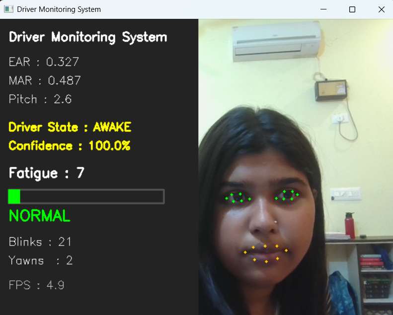
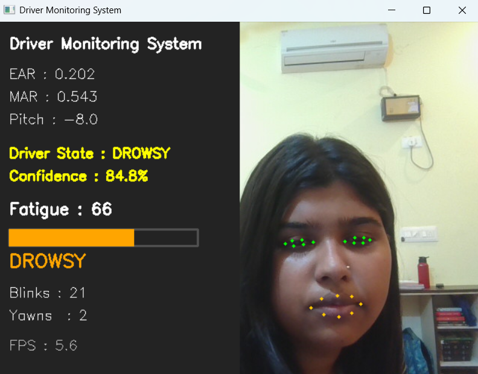
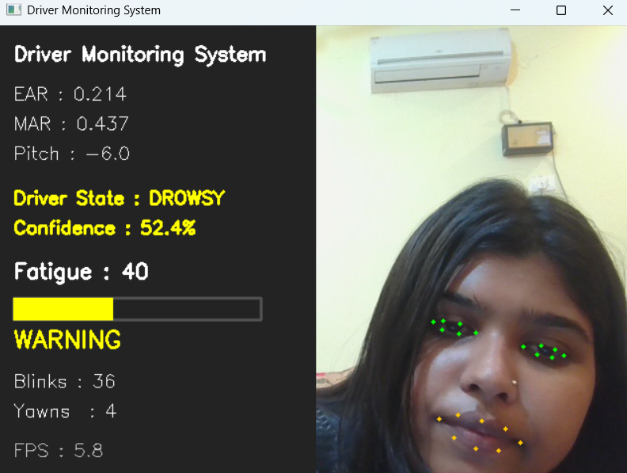
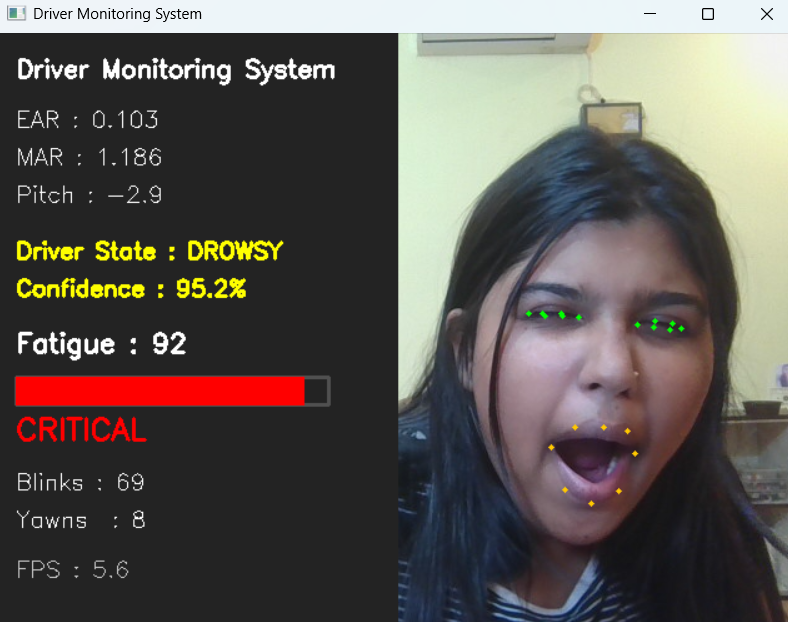

# Driver Monitoring System

A real-time Driver Monitoring System that detects signs of driver fatigue using **Computer Vision** and **Machine Learning**.

The system analyzes facial landmarks from a webcam to estimate **Eye Aspect Ratio (EAR)**, **Mouth Aspect Ratio (MAR)**, and **Head Pose**. These features are processed by a trained **Random Forest classifier** to predict the driver's state in real time. A rolling fatigue score, blink detection, yawn detection, and a live analytics dashboard provide continuous driver monitoring and visual alerts.


## Screenshots

| Normal Driving | Drowsiness Detected |
|----------------|---------------------|
|  |  |

| Warning | Critical Fatigue |
|-------------------|------------------|
|  |  |


# Features

-  Real-time webcam monitoring
-  468-point facial landmark detection using **MediaPipe Face Mesh**
-  Eye Aspect Ratio (EAR) based eye closure detection
-  Mouth Aspect Ratio (MAR) based yawn detection
-  Head Pose Estimation (Pitch, Yaw, Roll)
-  Random Forest based driver state prediction
-  Rolling fatigue score estimation
-  Multi-level fatigue alert system
-  Blink counter
-  Yawn counter
-  Live driver analytics dashboard
-  Real-time inference (~30 FPS)


#  System Architecture


                     Webcam
                        │
                        ▼
             OpenCV Video Capture
                        │
                        ▼
          MediaPipe Face Mesh (468 Landmarks)
                        │
                        ▼
             Feature Extraction Layer
      ┌──────────────┬──────────────┬─────────────┐
      │              │              │
      ▼              ▼              ▼
    EAR            MAR         Head Pose
      └──────────────┴──────────────┘
                     │
                     ▼
         Random Forest Classifier
                     │
                     ▼
        Rolling Fatigue Score Engine
                     │
                     ▼
          Alert & Analytics System
                     │
                     ▼
         Live Driver Monitoring Dashboard

#  Machine Learning Pipeline

### 1. Data Collection

Training samples are collected using a webcam.

Each frame generates the following feature vector:

- Eye Aspect Ratio (Left)
- Eye Aspect Ratio (Right)
- Average EAR
- Mouth Aspect Ratio (MAR)
- Pitch
- Yaw
- Roll

Each sample is labelled as:

- Awake
- Drowsy

### 2. Model Training

Algorithm used:

- Random Forest Classifier

Libraries:

- Scikit-learn
- NumPy
- Pandas

Evaluation Metrics:

- Accuracy
- Precision
- Recall
- F1 Score
- ROC-AUC

### 3. Live Prediction Pipeline

For every webcam frame:

1. Detect facial landmarks.
2. Extract EAR, MAR, and Head Pose.
3. Generate a feature vector.
4. Predict driver state using the trained Random Forest model.
5. Compute rolling fatigue score.
6. Update dashboard and alerts in real time.

#  Dashboard

The live dashboard displays:

- Driver State
- Prediction Confidence
- Eye Aspect Ratio (EAR)
- Mouth Aspect Ratio (MAR)
- Head Pose (Pitch)
- Fatigue Score
- Alert Level
- Blink Count
- Yawn Count
- FPS

#  Tech Stack

| Category | Technologies |
|----------|--------------|
| Language | Python 3.12 |
| Computer Vision | OpenCV |
| Face Tracking | MediaPipe Face Mesh |
| Machine Learning | Scikit-learn |
| Data Processing | NumPy, Pandas |
| Model | Random Forest |
| Model Serialization | Joblib |
| Visualization | OpenCV |

#  Project Structure
```
AI-Driver-Monitoring-System/
│
├── screenshots/
│   ├── normal.png
│   ├── drowsy.png
│   ├── warning.png
│   ├── critical.png
│
├── data/
│   └── processed/
│
├── models/
│
├── src/
│   ├── alerts/
│   ├── analytics/
│   ├── dashboard/
│   ├── fatigue/
│   ├── features/
│   ├── model/
│   └── vision/
│
├── tests/
│
├── config.py
├── data_collector.py
├── main.py
├── requirements.txt
└── README.md
```

#  Installation

Clone the repository

git clone https://github.com/harshithasundar/Driver-Monitoring-System.git

Navigate to the project

cd Driver-Monitoring-System


Create a virtual environment
python -m venv venv

Activate it

### Windows
venv\Scripts\activate

### Linux / macOS
source venv/bin/activate

Install dependencies

pip install -r requirements.txt

#  Usage

### Collect Training Data


python data_collector.py --label awake --samples 600
python data_collector.py --label drowsy --samples 600


### Train the Model

python -m src.model.trainer

### Run Live Monitoring

python main.py


#  Model Performance

The Random Forest classifier was trained on a custom dataset collected using the webcam.

Performance on the test set:

- **Accuracy:** ~99%
- **F1 Score:** ~0.99
- **ROC-AUC:** ~0.9999

The model performs real-time inference using facial landmark-derived features, enabling smooth and responsive driver monitoring.

---

#  Future Improvements

- PERCLOS-based fatigue estimation
- Session report generation (CSV/PDF)
- Automatic incident logging
- Configurable audio alerts
- CNN/LSTM based temporal models
- Mobile deployment
- Driver identification
- Night-time monitoring support

#  Author

Harshitha Sundar
B.Tech Computer Science & Engineering (Computer Networks)
